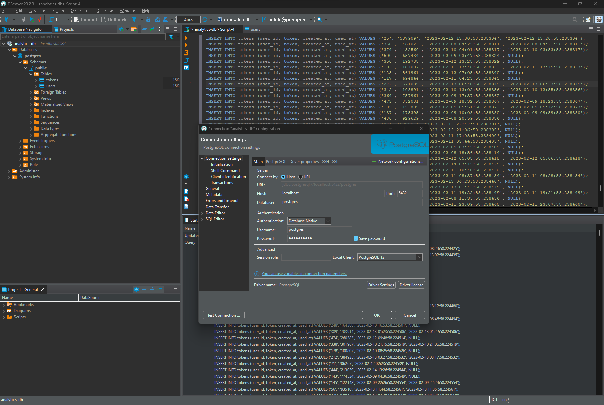

### Preparation
#### Local Environment
1. Python Environment - run Python 3.6+ applications and install Python dependencies via `pip`
2. Docker CLI - build and run Docker images locally
3. `kubectl` - run commands against a Kubernetes cluster
4. `helm` - apply Helm Charts to a Kubernetes cluster
5. `psql` - use to test database connection, query, execution
6. DBeaver - use to check data from database or execute sql scripts

#### Remote Resources
1. AWS CodeBuild - build Docker images remotely
2. AWS ECR - host Docker images
3. Kubernetes Environment with AWS EKS - run applications in k8s
4. AWS CloudWatch - monitor activity and logs in EKS
5. GitHub - pull and clone code

### 1. Create Docker Image and Push to AWS ECR
1. Create AWS ERC repository. See [creating a private repository](https://docs.aws.amazon.com/AmazonECR/latest/userguide/repository-create.html)

2. Create Docker Image by using AWS CodeBuild: create a [buildspect.yml](./buildspec.yml) file and push it to Github repository. In AWS CodeBuild, i will trigger build and push docker image to AWS ERC automatically by `PUSH` event. Note the Environment image, when creating a Node group in AWS EKS, I will choose the corresponding Instance Type.

### 2. Create a service and deployment using Kubernetes configuration files to deploy the application
#### Configure a Database and run on AWS EKS
1. You must connect to AWS from your local machine via AWS Access Key ID, AWS Secret Access Key, and AWS Session Token.

2. Create EKS cluster and Node group. The Instance type of the Node group must match the CodeBuild environment image as mentioned above.
Set up a Postgres database using a Helm Chart.

3. Use `aws eks update-kubeconfig --name <EKS_CLUSTER_NAME>` before running the below command. This command will connect local Kubernet to AWS EKS cluster. `EKS_CLUSTER_NAME` is the cluster name was created before.

* Use `kubectl cluster-info` to verify the local connected to AWS EKS.

4. Set up Bitnami Repo `helm repo add <REPO_NAME> https://charts.bitnami.com/bitnami`

5. Install PostgreSQL Helm Chart `helm install <SERVICE_NAME> <REPO_NAME>/postgresql --set primary.persistence.enabled=false`. This should set up a Postgre deployment at `<SERVICE_NAME>-postgresql.default.svc.cluster.local` in your Kubernetes cluster. 

* You can verify it by running `kubectl get svc` or `kubectl get serives` or go to `Resource` tab in the cluster you created before. By default, it will create a username `postgres`. 

* The password can be retrieved with the following command, this will save postgres password to use for Port Forwarding: 
```bash 
export POSTGRES_PASSWORD=$(kubectl get secret --namespace default <SERVICE_NAME>-postgresql -o jsonpath="{.data.postgres-password}" | base64 -d)
echo $POSTGRES_PASSWORD
```

* We shoud use the `echo -n $POSTGRES_PASSWORD | base64` command to get the password (base64) to use for database deployment file. See [db-secrect.yml](deployment/db-secret.yml)

6. Test Database Connection
The database is accessible within the cluster. This means that when you will have some issues connecting to it via your local environment. You can either connect to a pod that has access to the cluster _or_ connect remotely via [`Port Forwarding`](https://kubernetes.io/docs/tasks/access-application-cluster/port-forward-access-application-cluster/)

* Connecting Via Port Forwarding
```bash
kubectl port-forward --namespace default svc/<SERVICE_NAME>-postgresql 5432:5432 & PGPASSWORD=$POSTGRES_PASSWORD psql --host 127.0.0.1 -U postgres -d postgres -p 5432
```

* After forwarding the port, you can use DBeaver to connect to the database and copy seed scripts from `db/` folder and run  in DBeaver script editor. See below picture:


* Or we also could to run the seed files in `db/` in order to create the tables and populate them with data.
```bash
kubectl port-forward --namespace default svc/analytics-db-postgresql 5432:5432 & PGPASSWORD=$POSTGRES_PASSWORD psql --host 127.0.0.1 -U postgres -d postgres -p 5432 < <FILE_NAME.sql>
```

#### Run Analytics application on AWS EKS
1. Create deployment files: [analytics deployment file](deployment/analytics-api.yml), [database environment file](deployment/db-configmap.yml) and [database secret deployment file](deployment/db-secret.yml).

* In the analytics deployment file, the image is from AWS ECR repository.
* In the database environment file, database host is IP of Node Group.
* In the database secret deployment file, the password will be base64 as i mention above.
* Use `kubetl get svc` and `kubectl get pod` to verify the application work correctly. Or we can go to the AWS EKS Cluster, go to pod in `Resource Tab` to verify.

2. Deploy on AWS EKS
`kubectl apply -f deployment/`
* This command will create a deployment, a service and a pod.
* Similar to step 1, use `kubetl get svc` and `kubectl get pod` to verify the application work correctly. Or we can go to the AWS EKS Cluster, go to pod in `Resource Tab` to verify.

3. Apply AWS CloudWatch
```bash
ClusterName=<EKS_CLUSTER_NAME>
RegionName=<REGION>
FluentBitHttpPort='2020'
FluentBitReadFromHead='Off'
[[ ${FluentBitReadFromHead} = 'On' ]] && FluentBitReadFromTail='Off'|| FluentBitReadFromTail='On'
[[ -z ${FluentBitHttpPort} ]] && FluentBitHttpServer='Off' || FluentBitHttpServer='On'
curl https://raw.githubusercontent.com/aws-samples/amazon-cloudwatch-container-insights/latest/k8s-deployment-manifest-templates/deployment-mode/daemonset/container-insights-monitoring/quickstart/cwagent-fluent-bit-quickstart.yaml | sed 's/{{cluster_name}}/'${ClusterName}'/;s/{{region_name}}/'${RegionName}'/;s/{{http_server_toggle}}/"'${FluentBitHttpServer}'"/;s/{{http_server_port}}/"'${FluentBitHttpPort}'"/;s/{{read_from_head}}/"'${FluentBitReadFromHead}'"/;s/{{read_from_tail}}/"'${FluentBitReadFromTail}'"/' | kubectl apply -f -
```

* Note that we must add `CloudWatchAgentServerPolicy` policy to EKS Node Group.


#### Note: 

### Deliverables
1. [Dockerfile](analytics/Dockerfile)
2. [Screenshot of AWS CodeBuild pipeline](images/3a-CodeBuild-pipeline.png)
3. [Screenshot of AWS ECR repository for the application's repository](images/3b-ECR-repository.png)
4. [Screenshot of kubectl get svc](images/5a-kubectl-get-svc.png)
5. [Screenshot of kubectl get pods](images/5b-kubectl-get-pods.png)
6. [Screenshot of kubectl describe svc <DATABASE_SERVICE_NAME>](images/5c-kubectl-describe-svc-database-service.png)
7. [Screenshot of kubectl describe deployment <SERVICE_NAME>](images/5d-kubectl-describe-deployment-service.png)
8. [All Kubernetes config files used for deployment (ie YAML files)](./images/)
9. [Screenshot of AWS CloudWatch logs for the application](images/6b-container-insight.png)


### Stand Out Suggestions
Please provide up to 3 sentences for each suggestion. Additional content in your submission from the standout suggestions do _not_ impact the length of your total submission.
1. When configuring Memory and CPU allocation in the Kubernetes deployment configuration, I chose the Instance Type for Node Group to be a1.large, because when deploying the application, there are some operations such as pulling docker images that will cause errors if we use "micro" Instance Types
2. In this project I used Instance type a1.large because if using smaller types, when application performance increases, it will not be able to run because of memory overflow.
3. I think to save costs, we should choose the appropriate Instance type. To know which one to choose, we should run the application locally first, then calculate and choose the appropriate Instance Type. We should also choose the appropriate number of EKS node groups because too many can cause redundancy and waste of resources.

### Best Practices
* Dockerfile uses an appropriate base image for the application being deployed. Complex commands in the Dockerfile include a comment describing what it is doing.
* The Docker images use semantic versioning with three numbers separated by dots, e.g. `1.2.1` and  versioning is visible in the screenshot. See [Semantic Versioning](https://semver.org/) for more details.